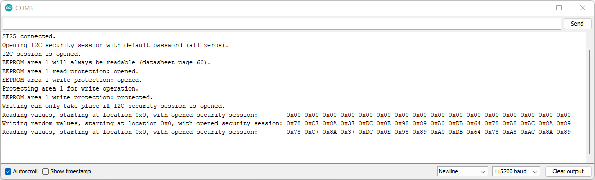
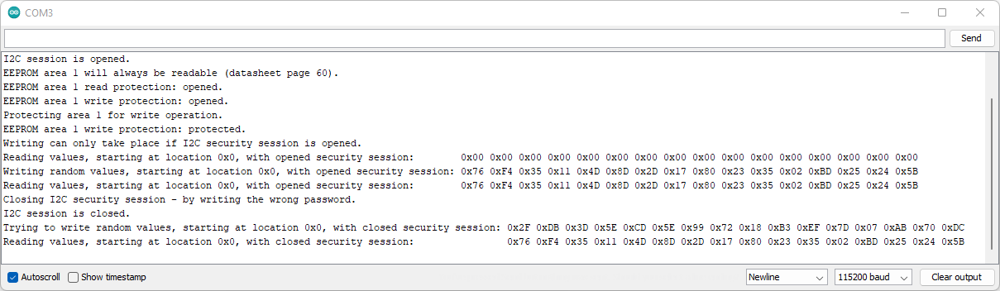
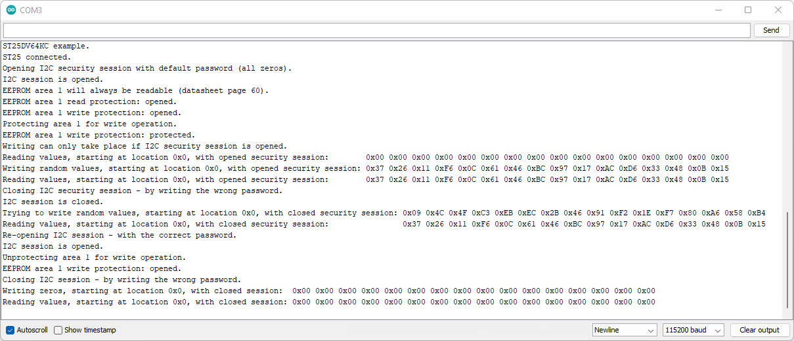

# Example 2 - Memory Read Write Operations

A more complex example showing how to read and write the tag's EEPROM memory using the SparkFun ST25DV64KC Arduino Library.

## Key Features

- Opening a I2C Security Session using the password
- Reading and changing the memory read and write protection
- Reading memory
- Writing to memory
- Demonstrating how the password can control writing

## Tag Memory

The ST25DV64KC has 64-kBits of EEPROM user memory. That's 8-kBytes or 8102 Bytes. We can use all of that memory to store data.

The ST25DV tags are "dynamic". The memory can be read and written to using both I2C and RF (NFC). For I2C, the tag needs to be powered up via your Arduino board.
But for RF, the tag memory can be read and written to even when the tag is powered off. The RF field provides the power.

By default, the memory can be both read and written using both I2C and RF. We do not need to enter a password for either interface.
But it is possible to change that using the tag's read and write protection settings. There are independent settings for I2C and RF.

The tag's memory can also be divided up into four areas. By default, Area 1 occupies the whole 8-kBytes of memory and Areas 2-4 are zero length.
Example 4 demonstrates how to change the size of the areas.

Area 1 is special in that it is _always_ readable. We can only change its write permission. Areas 2-4 can be both read and write protected.

If we enable the I2C write protection for Area 1, we need to enter a password before we can write to Area 1. Remember that Area 1 is always readable.

The default password is eight zero bytes: 0x00, 0x00, 0x00, 0x00, 0x00, 0x00, 0x00, 0x00. Example 3 shows how to change the password.

## Entering The Password

Example 2 starts by beginning communication with the tag. It then enters the I2C password so we can change the write protection.

By default, we do not _need_ to enter a password to write _data_ to Area 1. Write protection is disabled by default.
_But_ we do need to enter the password to be able to _change_ the write protection.

ST use the term "Security Session" to describe the time when the password has been entered and we can make changes to the tag's security settings.

The example opens a security session by calling ```openI2CSession``` and providing the password:

```C++
  Serial.println(F("Opening I2C security session with default password (all zeros)."));
  uint8_t password[8] = {0x0}; // Default password is all zeros
  tag.openI2CSession(password); // Enter the password
```

The example then checks if the password has been entered correctly by calling ```isI2CSessionOpen```:

```C++
  Serial.print(F("I2C session is "));
  Serial.println(tag.isI2CSessionOpen() ? "opened." : "closed.");
```

## Checking Read and Write Protection

The example checks if Area 1 is read-protected by calling ```getEEPROMReadProtectionBit(1)```. Remember that Area 1 is _always_ readable.

```C++
  Serial.println(F("EEPROM area 1 will always be readable (datasheet page 60)."));
  Serial.print(F("EEPROM area 1 read protection: "));
  Serial.println(tag.getEEPROMReadProtectionBit(1) ? "protected." : "opened.");
```

```getEEPROMReadProtectionBit``` returns **true** if read protection is enabled and **false** if not.

If we wanted to check Area 2, we would call ```getEEPROMReadProtectionBit(2)```.

The example uses shorthand - ```?``` and ```:``` - to print "protected" and "opened". It is exactly the same as:

```C++
  if (tag.getEEPROMReadProtectionBit(1))
     Serial.println("protected.");
  else
    Serial.println("opened.");
```

The example then checks the write protection by calling ```getEEPROMWriteProtectionBit```:

```C++
  Serial.print(F("EEPROM area 1 write protection: "));
  Serial.println(tag.getEEPROMWriteProtectionBit(1) ? "protected." : "opened.");
```

## Changing the Write Protection

Remember that, by default, Area 1 is not write-protected. Writing is "open". We do no need to enter a password to write to Area 1.
But we do need to enter the password to change the write-protection.

We can enable write protection for Area 1 by calling ```programEEPROMWriteProtectionBit```.

```programEEPROMWriteProtectionBit(1, true)``` sets the write protection bit for Area 1.

```C++
  Serial.println(F("Protecting area 1 for write operation."));
  tag.programEEPROMWriteProtectionBit(1, true);

  bool area1WriteProtected = tag.getEEPROMWriteProtectionBit(1);
  Serial.print(F("EEPROM area 1 write protection: "));
  Serial.println(area1WriteProtected ? "protected." : "opened.");
  if (area1WriteProtected)
    Serial.println(F("Writing can only take place if I2C security session is opened."));
```

Now that write protection is enabled, we can only write to Area 1 if we have entered the password.

## Memory Read

We read the tag's EEPROM memory by calling ```readEEPROM```:

```C++
  // Read 16 bytes from EEPROM location 0x0
  uint8_t tagRead[16] = {0}; // Create storage to hold the tag read
  Serial.print(F("Reading values, starting at location 0x0, with opened security session:        "));
  tag.readEEPROM(0x0, tagRead, 16); // Read the EEPROM: start at address 0x0; read contents into tagRead; read 16 bytes
```

The code creates an array of ```uint8_t``` (unsigned 8-bit bytes) to hold the memory contents.

The code then reads the first 16 memory locations using ```readEEPROM```:

- The ```0x00``` tells the method to start at address zero.
- The contents will be written into the array ```tagRead```
- Exactly ```16``` bytes will be read

The example then prints the memory contents in hexadecimal format, like we did with the UID in Example 1.

```C++
  for (auto value : tagRead) // Print the contents
  {
    Serial.print(F("0x"));
    if (value < 0x10)
      Serial.print(F("0")); // Add a leading zero if required
    Serial.print(value, HEX); // Print the contents in HEX format
    Serial.print(F(" "));
  }
  Serial.println();
```

The ```for (auto value : tagRead)``` is more code shorthand. It is exactly the same as writing:

```C++
  for (uint8_t value = 0; value < sizeof(tagRead); value++)
```

## Memory Write

Now the fun part! The example writes 16 random bytes to the first 16 memory locations:

```C++
  // Try to write 16 random bytes to EEPROM starting at location 0x0
  uint8_t tagWrite[16]; // Create storage to hold the data to be written
  randomSeed(analogRead(A0));
  for (uint8_t i = 0; i < 16; i++) // Generate 16 random values and store them in tagWrite
    tagWrite[i] = (uint8_t)random(0, 0xff);

  Serial.print(F("Writing random values, starting at location 0x0, with opened security session: "));
  // ...
  Serial.println();
  tag.writeEEPROM(0x0, tagWrite, 16); // Write data to EEPROM: start at address 0x0; use the data in tagWrite; write 16 bytes
```

The code creates 16 random values and puts them into an array called ```tagWrite```. The actual writing is performed by ```writeEEPROM```:

- The ```0x00``` tells the method to start at address zero.
- Write the data in the array ```tagWrite```
- Exactly ```16``` bytes will be written

The code then reads those 16 bytes back again, just to prove they have been written correctly:



## Closing the Security Session

Remember that we enabled Area 1 write protection earlier in the example. We can only write data to Area 1 if we have opened a security session
by entering the correct password.

We can close the security session by entering the wrong password:

```C++
  Serial.println(F("Closing I2C security session - by writing the wrong password."));
  password[1] = {0x10}; // Change one byte of the password
  tag.openI2CSession(password);

  Serial.print(F("I2C session is "));
  Serial.println(tag.isI2CSessionOpen() ? "opened." : "closed.");
```

It does not matter what password we enter, so long as it is not the current password (all zeros).

If we try to write data to Area 1 now, the write is rejected and the memory is not changed:



We can not change the write protection either because the security session is closed.

## Changing the Write Protection (Again)

The example concludes by doing the following:

- The correct password is entered using ```openI2CSession```
- Area 1 write protection is turned off using ```programEEPROMWriteProtectionBit```
- The security session is closed by entering the wrong password
- The random data we wrote earlier is _overwritten_ with zeros

This leaves the tag in its default state: write protection is not enabled; and the first 16 memory locations are all zero



