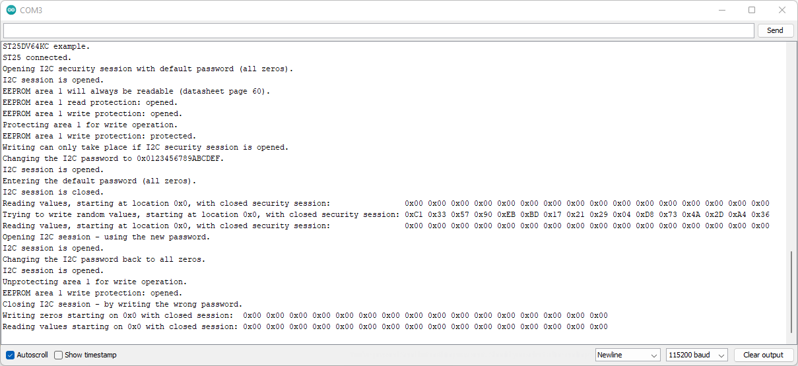

# Example 3 - I2C Password

An example showing how to change the I<sup>2</sup>C password using the SparkFun ST25DV64KC Arduino Library.

## Key Features

- Opening a I<sup>2</sup>C Security Session using the password
- Changing the I<sup>2</sup>C password
- Demonstrating how the password can control writing

## Changing The Password

Example 2 demonstrated how the I<sup>2</sup>C password can be used to open a security session, so the tag's settings - like write protection - can be changed.

Remember that:

- Area 1 can always be read. There is no read protection on Area 1
- By default, Area 1 is not write-protected
- We can only change the write protection by opening a security session using the correct password
- The default password is all zeros ( 0x00, 0x00, 0x00, 0x00, 0x00, 0x00, 0x00, 0x00 )

Same as Example 2, this example begins by opening a security session using the default password and enabling write-protection on Area 1.
Area 1 can then only be modified if the correct password has entered.

Example 3 then demonstrates how to change the I<sup>2</sup>C password using ```writeI2CPassword```. As you would expect, we can only change the password
having first entered the correct password to open a security session.

```C++
  Serial.println(F("Changing the I2C password to 0x0123456789ABCDEF."));
  uint8_t newPassword[8] = { 0x01, 0x23, 0x45, 0x67, 0x89, 0xAB, 0xCD, 0xEF };
  tag.writeI2CPassword(newPassword);
  Serial.print(F("I2C session is "));
  Serial.println(tag.isI2CSessionOpen() ? "opened." : "closed.");
```

!!! attention
    The password can be read back from the tag, _**but**_ only when a security session is open. If you change the password, close the security session and then forget the password, _**your tag is locked forever**_. There is no way to change or reset the pasword unless you know the password. If you change it, write it down somewhere!

Like Example 2, Example 3 goes on to demonstrate that by entering the wrong password (all zeros in this case) the memory can not then be changed - because write protection is enabled.

The example cleans up after itself by:

- Re-entering the new password
- Changing the password back to all zeros
- Turning off write protection
- Closing the security session
- Writing zeros to the first 16 memory locations

<center>
[{ width="400" }](img/ex_03_Serial_Monitor.png)<br>
*Arduino IDE Serial Monitor output for Example 3. (Click to enlarge)*
</center>
