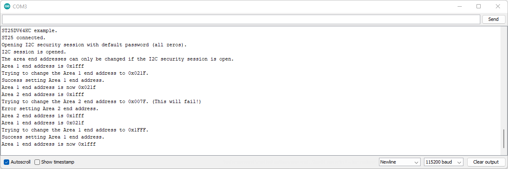

# Example 4 - Memory End Addresses

An example showing how to configure the user memory areas using the SparkFun ST25DV64KC Arduino Library.

## Key Features

- Opening a I2C Security Session using the password
- Changing the size of Area 1 by changing its end address
- Attempting to change the size of Area 2 using an invalid end address
- Changing the size of Area 1 back to the default

## Changing Area 1

We mentioned back in Example 2 that the ST25DV64KC user memory can be divided up into four areas. By default, Area 1 occupies the full 8-kBytes of memory.

The size of the four areas can be changed by changing their end addresses. By default, all four end addresses on the ST25DV64KC are the same:

| Area | End Address | End Address (Hex) | End Address (Decimal) |
| :--- | :--- | :--- | :--- |
| `1` |  ENDA1 | 0x1FFF | 8191 |
| `2` |  ENDA2 | 0x1FFF | 8191 |
| `3` |  ENDA3 | 0x1FFF | 8191 |
| `4` |  ENDA4 | 0x1FFF | 8191 |

Area 1 always starts at location zero, so by having all four end addresses the same, Areas 2-4 are actually zero length. Area 2 starts where Area 1 ends. And so on.

This library will work with smaller ST25DV devices. For the ST25DV04KC, the memory is 4-kBits which is 512 Bytes. Its Area 1 end address (ENDA1) is 0x01FF.

!!! note
    When accessing the memory via the RF interface, the memory is read and written in blocks of four bytes. The last user memory block address, seen by RF, for the ST25DV64KC is 0x07FF. It is still possible to access the full memory via the RF interface.

It can be useful to change the memory area sizes so that different security levels can be applied to each. Remember that Area 1 is always readable, but can be write-protected. For Areas 2-4, it is possible to apply read-protection. It is also possible to apply different security levels for the I2C and RF interfaces for each area.

Example 4 changes the size of Area 1 by calling ```setMemoryAreaEndAddress```.

The end address is defined using a single byte. The true end address is: (32 * ENDA) + 31

For Area 1, the default value of ENDA1 is actually 0xFF (Hexadecimal) or 255 (Decimal). (32 * 255) + 31 = 8191

The area sizes can only be changed in increments of 32 bytes. The minimum size for Area 1 is 32 bytes (when ENDA1 is zero).

Remember that we need to open a security session first, before we attempt to change the end addresses.

Example 4 changes the Area 1 end address to 0x021F by calling ```setMemoryAreaEndAddress(1, 0x10)```. It reads back the new end address by calling ```getMemoryAreaEndAddress```.

```C++
  // Change the Area 1 end address:
  // This function will succeed if ENDA1 value is less than or equal to ENDA2 and ENDA3.
  // Further information can be found in the datasheet on page 14.
  // Memory address will be: 0x20 * ENDAi + 0x1f which in this case results
  // in 0x20 * 0x10 + 0x1f = 0x021f
  Serial.println(F("Trying to change the Area 1 end address to 0x021F."));
  if (tag.setMemoryAreaEndAddress(1, 0x10))
  {
    Serial.println(F("Success setting Area 1 end address."));
  }
  else
  {
    Serial.println(F("Error setting Area 1 end address."));
  }

  memset(endAddress, 0, 5);
  
  Serial.print(F("Area 1 end address is now 0x"));
  sprintf(endAddress, "%04x", tag.getMemoryAreaEndAddress(1)); // Get the area 1 end address. Print it into endAddress in HEX format
  Serial.println(endAddress); // Print it
```

Area 1 now occupies addresses 0x0000 to 0x021F. Area 2 now occupies addresses 0x0220 to 0x1FFF. Areas 3 and 4 are still zero size.

Just to prove that it is not possible, the example then tries to set the Area 2 end address to _less than_ 0x021F. This fails as the areas cannot 'overlap'.
ENDA2 must always be greater than or equal to ENDA1.

```C++
  // Change the Area 2 end address:
  // This function will fail since ENDA2 value is less than if ENDA1 programmed above.
  // Further information can be found on the datasheet on page 14.
  // Memory address will be: 0x20 * ENDAi + 0x1f which in this case results
  // in 0x20 * 0x03 + 0x1f = 0x007f
  Serial.println(F("Trying to change the Area 2 end address to 0x007F. (This will fail!)"));
  if (tag.setMemoryAreaEndAddress(2, 0x03))
  {
    Serial.println(F("Success setting Area 2 end address."));
  }
  else
  {
    Serial.println(F("Error setting Area 2 end address."));
  }

  memset(endAddress, 0, 5);
  
  Serial.print(F("Area 2 end address is 0x"));
  sprintf(endAddress, "%04x", tag.getMemoryAreaEndAddress(2));
  Serial.println(endAddress);
```

The example finishes by restoring ENDA1 back to 0x1FFF:

```C++
  // Restore ENDA1:
  // This function will succeed if ENDA1 value is less than or equal to ENDA2 and ENDA3.
  // Further information can be found on the datasheet on page 14.
  // Memory address will be: 0x20 * ENDAi + 0x1f which in this case results
  // in  0x20 * 0xff + 0x1f = 0x1fff
  Serial.println(F("Trying to change the Area 1 end address to 0x1FFF."));
  if (tag.setMemoryAreaEndAddress(1, 0xFF))
  {
    Serial.println(F("Success setting Area 1 end address."));
  }
  else
  {
    Serial.println(F("Error setting Area 1 end address."));
  }
  
  memset(endAddress, 0, 5);
  
  Serial.print(F("Area 1 end address is now 0x"));
  sprintf(endAddress, "%04x", tag.getMemoryAreaEndAddress(1));
  Serial.println(endAddress);
```



