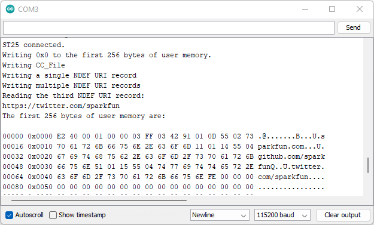
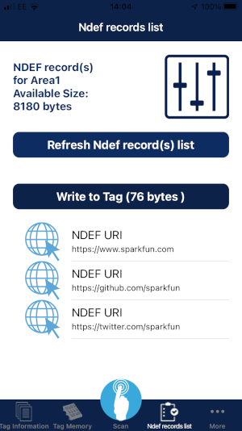

# Example 8 - NDEF URI

An example showing how to create an NDEF URI record using the SparkFun ST25DV64KC Arduino Library.

## Key Features

- Writing the tag's Capability Container (CC)
- Writing an NDEF URI record
- Reading an NDEF URI record

## NFC Forum Type 5 Tag and NDEF

From the ST website:

"Near Field Communication (NFC) Type 5 tags (T5T) and labels operate in the high-frequency (HF) 13.56 MHz range and comply with the NFC-V Technology specification from the NFC Forum. The data stored in these Type 5 tags and labels is transferred to NFC smartphones or professional NFC/RFID HF readers that support the NFC Forum standardized NFC Data Exchange Format (NDEF)."

"ST25 Type 5 Tag chips are certified by the NFC Forum and comply with the industrial ISO/IEC 15693 RFID specifications, providing interoperability across NFC implementations in NFC smartphones and NFC/RFID HF readers."

## Creating a Capability Container

Up until now, the library examples have been writing 'unformatted data' to the tag's memory.
To allow the data to be read and understood by the NFC App on your smart phone, we need to write the data in NFC Data Exchange Format (NDEF).

To begin, we need to write a Capability Container at the very start of the tag's memory (Address 0x0000).
This is an 8-byte (or 4-byte) number which describes the tag's version, access condition and encoded memory length.

For the 8-kByte ST25DV64KC, the CC is set to:

- E2 40 00 01 00 00 04 00h to work properly with smartphone
- E2 40 00 01 00 00 03 FFh for NFC Forum certification

This library defaults to using the NFC Forum value:

```C++
/*
  The Capacity Container File is written to the first eight bytes of user memory:

  0xE2 0x40 0x00 0x01 0x00 0x00 0x03 0xFF

  Byte 0: Magic Number
          The ST25DV64KC has 8kBytes of user memory so we need to select 0xE2 to select two-byte addressing
  Byte 1: Version and Access Condition
          b7 b6 = 0b01 Major Version
          b5 b4 = 0b00 Minor Version
          b3 b2 = 0x00 Read Access: Always
          b1 b0 = 0x00 Write Access: Always
  Byte 2: 0x00
  Byte 3: Additional Feature Information
          b7 b6 b5 = 0b000 RFU (Reserved Future Use)
          b4 = 0b0 Special Frame
          b3 = 0b0 Lock Block
          b2 b1 = 0b00 RFU
          b0 = 0b1 MBREAD: Read Multiple Block is supported
  Byte 4: 0x00 RFU (Reserved Future Use)
  Byte 5: 0x00 RFU (Reserved Future Use)
  Byte 6 + Byte 7: MLEN Encoded Memory Length
          MLEN = T5T_Area / 8
          MLEN encoding for a ST25DV64K (8192 bytes memory size) and 8 bytes capability container (CC):
          If the entire user memory full, user memory is used to store NDEF, T5T_Area=8192-8
          MLEN = (8192 – 8) / 8 = 1023 (0x03FF)
*/
```

Example 8 begins by clearing the tag's memory, just in case it contains any 'old' information. This is done with ```writeEEPROM``` - see Example 2 for more details.

The default Capability Container is written by calling ```writeCCFile8Byte()```:

```C++
  // Write the Type 5 CC File - eight bytes - starting at address zero
  Serial.println(F("Writing CC_File"));
  tag.writeCCFile8Byte();
```

If you want to use a non-standard CC, you can define your own e.g. by calling:

```C++
  tag.writeCCFile8Byte( 0xE2400001, 0x00000400 );
```

If you are using a small tag, like the ST25DV04K, you could call:

```C++
  // Write the Type 5 CC File - four bytes - starting at address zero
  Serial.println(F("Writing CC_File"));
  tag.writeCCFile4Byte();
```

To write a non-standard CC to the ST25DV04K, you could call:

```C++
  tag.writeCCFile4Byte( 0xE1404000 );
```

## Creating an NDEF URI Record

Now that the T5T CC has been written, we can start adding NDEF records.

One of the most useful records is the Well-Known Uniform Resource Identifier (URI) which covers web address URLs (Uniform Reference Locator).

If we want to write a single URI into the tag, we can simply call:

```C++
    tag.writeNDEFURI("sparkfun.com", SFE_ST25DV_NDEF_URI_ID_CODE_HTTPS_WWW);
```

This writes the URI ```https://www.sparkfun.com``` in shorthand format using the HTTPS WWW ID Code to save memory.

We could have called:

```C++
    tag.writeNDEFURI("https://www.sparkfun.com", SFE_ST25DV_NDEF_URI_ID_CODE_NONE);
```

but the first way is more memory-efficient. ```SFE_ST25DV_NDEF_URI_ID_CODE_NONE``` is the default ID Code, so we could have simply called:

```C++
    tag.writeNDEFURI("https://www.sparkfun.com");
```

```writeNDEFURI``` does all of the heavy lifting for us. It formats the NDEF data correctly, adding:

- The NDEF Message Type Field
- The Length Field - correctly formatted as 1-Byte or 3-Bytes as appropriate
- The Header, Length and Payload data for the URI Value itself
- The Terminator

```C++
/*
  To create a single NDEF URI short record:

  0x03 0x11 0xD1 0x01 0x0D 0x55 0x02 sparkfun.com 0xFE

  Byte 0: Type5 Tag TLV-Format: T (Type field)
          0x03 = NDEF Message TLV
  Byte 1: Type5 Tag TLV-Format: L (Length field) (1-Byte Format)
          0x11 = 17 Bytes
  Bytes 2-18: Type5 Tag TLV-Format: V (Value field)
          Byte 2: Record Header = 0xD1
                  b7 = 0b1 MB (Message Begin)
                  b6 = 0b1 ME (Message End)
                  b5 = 0b0 CF (Chunk Flag)
                  b4 = 0b1 SR (Short Record)
                  b3 = 0b0 IL (ID Length)
                  b2 b1 b0 = 0b001 TNF (Type Name Format): NFC Forum Well-Known Type
          Byte 3: Type Length
                  0x01 = 1 Byte
          Byte 4: Payload Length
                  0x0D = 13 bytes
          Byte 5: Record Type
                  0x55 = "U" URI Record
          Byte 6: URI Prefix Code
                  0x02 = https://www.
          Bytes 7-18: URI (12 bytes)
                  sparkfun.com
  Byte 19: Type5 Tag TLV-Format: T (Type field)
          0xFE = Terminator TLV
*/
```

## SFE_ST25DV64KC_NDEF Class

To be able to use the extra NDEF methods, we need to use the ```SFE_ST25DV64KC_NDEF``` class, instead of ```SFE_ST25DV64KC```:

```C++
  SFE_ST25DV64KC_NDEF tag;
```

```SFE_ST25DV64KC_NDEF``` inherits all of the ```SFE_ST25DV64KC``` methods, so we can do everything with a single ```SFE_ST25DV64KC_NDEF``` object.

## Writing multiple NDEF URI Records

If we want to write multiple records, we need to keep track of which address each URI is written to, so the URIs can be concatenated correctly.

We also need to tell ```writeNDEFURI``` which is the first record (Message Begin = 1) and which is the last (Message End = 1).

The code becomes:

```C++
  uint16_t memoryLocation = tag.getCCFileLen(); // Start writing at the memory location immediately after the CC File
  tag.writeNDEFURI("sparkfun.com", SFE_ST25DV_NDEF_URI_ID_CODE_HTTPS_WWW, &memoryLocation, true, false); // Message Begin = 1, Message End = 0
  tag.writeNDEFURI("github.com/sparkfun", SFE_ST25DV_NDEF_URI_ID_CODE_HTTPS, &memoryLocation, false, false); // Message Begin = 0, Message End = 0
  tag.writeNDEFURI("twitter.com/sparkfun", SFE_ST25DV_NDEF_URI_ID_CODE_HTTPS, &memoryLocation, false, true); // Message Begin = 0, Message End = 1
```

Each time ```writeNDEFURI``` is called, it starts writing at ```memoryLocation```. When the write is complete, ```memoryLocation``` is updated
so that the next record is written starting at the next memory location.

The three URIs written by the example are:

- ```https://www.sparkfun.com```
- ```https://github.com/sparkfun```
- ```https://twitter.com/sparkfun```

It is possible to write multiple URI, WiFi and Text records into a single tag.

## Reading an NDEF URI Record

There may be times when we want to read back a URI from the tag. E.g. if you have updated the tag using your smart phone and want to use the new
URI in your Arduino code.

The code to do this is:

```C++
  // Read back the third URI
  char theURI[30];
  Serial.println(F("Reading the third NDEF URI record:"));
  if (tag.readNDEFURI(theURI, 30, 3))
    Serial.println(theURI);
  else
    Serial.println(F("Read failed!"));
```

```theURI``` is a 30-byte char array which will hold the URI. It needs to be long enough to contain the whole URI, including the ```https:///www.``` prefix.

```readNDEFURI(theURI, 30, 3)``` performs the read. The URI is written into ```theURI```. The ```30``` tells ```readNDEFURI``` how many chars ```theURI``` can hold.
If the URI is too long for ```theURI```, ```readNDEFURI``` will return **false**. Finally, the ```3``` tells ```readNDEFURI``` to return the third URI from tag memory.

To read the first URI, we could have called ```readNDEFURI(theURI, 30)``` as the URI defaults to 1.

If we call ```readNDEFURI(theURI, 30, 4)```, the result is **false** as the tag only contains three URIs. This is a trick we can use to determine how many URIs the tag contains.

You can use "NFC Tap" to check the NDEF data.





Just for fun, you can "swipe left" on a URI record in NFC Tap, change the URI, and then write it back to the tag.
If you comment out the first part of the example, leaving only the ```readNDEFURI```, you will be able to read the new URI.


