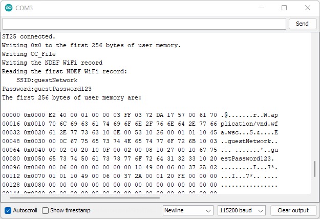
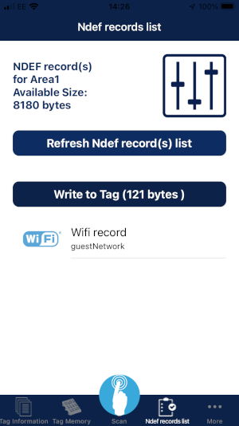

# Example 9 - NDEF WiFi

An example showing how to create an NDEF WiFi record using the SparkFun ST25DV64KC Arduino Library.

## Key Features

- Writing the tag's Capability Container (CC)
- Writing an NDEF WiFi record
- Reading an NDEF WiFi record

## Creating an NDEF WiFi Record

A lot of information needs to be contained in an NDEF WiFi record, not simply the SSID and Password:

```C++
/*
  To create a single NDEF WiFi short record:

  00000 0x0000 E2 40 00 01 00 00 03 FF 03 72 DA 17 57 00 61 70 .@.......r..W.ap
  00016 0x0010 70 6C 69 63 61 74 69 6F 6E 2F 76 6E 64 2E 77 66 plication/vnd.wf
  00032 0x0020 61 2E 77 73 63 10 0E 00 53 10 26 00 01 01 10 45 a.wsc...S.&....E
  00048 0x0030 00 0C 67 75 65 73 74 4E 65 74 77 6F 72 6B 10 03 ..guestNetwork..
  00064 0x0040 00 02 00 20 10 0F 00 02 00 08 10 27 00 10 67 75 ... .......'..gu
  00080 0x0050 65 73 74 50 61 73 73 77 6F 72 64 31 32 33 10 20 estPassword123.
  00096 0x0060 00 06 00 00 00 00 00 00 10 49 00 06 00 37 2A 02 .........I...7*.
  00112 0x0070 01 01 10 49 00 06 00 37 2A 00 01 20 FE

  Starting at memory location 0008:

  Byte 0: Type5 Tag TLV-Format: T (Type field)
          0x03 = NDEF Message TLV
  Byte 1: Type5 Tag TLV-Format: L (Length field) (1-Byte Format)
          0x72 = 114 Bytes
  Bytes 2-115: Type5 Tag TLV-Format: V (Value field)
          Byte 2: Record Header = 0xDA
                  b7 = 0b1 MB (Message Begin)
                  b6 = 0b1 ME (Message End)
                  b5 = 0b0 CF (Chunk Flag)
                  b4 = 0b1 SR (Short Record)
                  b3 = 0b1 IL (ID Length)
                  b2 b1 b0 = 0b010 TNF (Type Name Format): Media-type as defined in RFC 2046
          Byte 3: Type Length
                  0x17 = 23 Bytes
          Byte 4: Payload Length
                  0x57 = 87 Bytes
          Byte 5: ID Length
                  0x00 = 0 Bytes
          Bytes 6-28: Type (23 bytes)
                  "application/vnd.wfa.wsc"
          Start of Payload:
          Bytes 29+30: 0x100E (WiFi Credential)
          Bytes 31+32: 0x00 0x53 (Length = 83)
          Bytes 33+34: 0x1026 (Network Index)
          Bytes 35+36: 0x00 0x01 (Length = 1)
          Byte 37:     0x01 (Value 1 is used for backwards compatibility)
          Bytes 38+39: 0x1045 (SSID)
          Bytes 40+41: 0x00 0x0C (length = 12)
          Bytes 42-53: "guestNetwork"
          Bytes 54+55: 0x1003(Authentication Type)
          Bytes 56+57: 0x00 0x02 (Length = 2)
          Bytes 58+59: 0x00 0x20 (WPA2 Personal)
          Bytes 60+61: 0x100F (Encryption Type)
          Bytes 62+63: 0x00 0x02 (Length = 2)
          Bytes 64+65: 0x00 0x08 (AES)
          Bytes 66+67: 0x1027 (Network Key)
          Bytes 68+69: 0x00 0x10 (Length = 16)
          Bytes 70-85: "guestPassword123"
          Bytes 86+87: 0x1020 (MAC Address)
          Bytes 88+89: 0x00 0x06 (Length = 6)
          Bytes 90-95: 0x00 0x00 0x00 0x00 0x00 0x00
          Bytes 96+97: 0x1049 (Vendor Extension)
          Bytes 98+99: 0x00 0x06 (Length = 6)
          Bytes 100-102: 0x00 0x37 0x2A (Vendor ID)
          Byte 103: 0x02 (Network Key Shareable)
          Byte 104: 0x01 (Length)
          Byte 105: 0x01 (True)
          Bytes 106+107: 0x1049 (Vendor Extension)
          Bytes 108+109: 0x00 0x06 (Length = 6)
          Bytes 110-112: 0x00 0x37 0x2A (Vendor ID)
          Byte 113: 0x00 (Version2)
          Byte 114: 0x01 (Length)
          Byte 115: 0x20 (Version 2.0)
          End of Payload
  Byte 116: Type5 Tag TLV-Format: T (Type field)
          0xFE = Terminator TLV
*/
```

Fortunately ```writeNDEFWiFi``` does all of the heavy lifting for you. Creating a WiFi record is as simple as:

```C++
  // Write a single NDEF WiFi record
  Serial.println(F("Writing the NDEF WiFi record"));
  tag.writeNDEFWiFi("guestNetwork", "guestPassword123");
```

Again, like ```writeNDEFURI```, you can write multiple records if you wish:

```C++
  uint16_t memoryLocation = tag.getCCFileLen(); // Start writing at the memory location immediately after the CC File
  tag.writeNDEFWiFi("guestNetwork", "guestPassword123", &memoryLocation, true, false); // Message Begin = 1, Message End = 0
  tag.writeNDEFWiFi("guestNetwork2", "guestPassword456", &memoryLocation, false, true); // Message Begin = 0, Message End = 1
```

It is possible to write multiple URI, WiFi and Text records into a single tag.

## Reading an NDEF WiFi Record

You are much more likely to want to read an NDEF WiFi record, having written it to the tag using your smart phone.

Reading the record is as simple as:

```C++
  // Read the first NDEF WiFi record
  char ssid[20]; // Create storage for the SSID
  char passwd[20]; // Create storage for the password
  Serial.println(F("Reading the first NDEF WiFi record:"));
  if (tag.readNDEFWiFi(ssid, 20, passwd, 20, 1)) // Read the first record. The '1' is optional
  {
    Serial.print(F("    SSID:"));
    Serial.println(ssid);
    Serial.print(F("Password:"));
    Serial.println(passwd);
  }
  else
    Serial.println(F("Read failed!"));
```





Just for fun, you can "swipe left" on a WiFi record in NFC Tap, change the details, and then write it back to the tag.
If you comment out the first part of the example, leaving only the ```readNDEFWiFi```, you will be able to read the new details.


