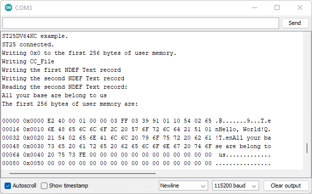
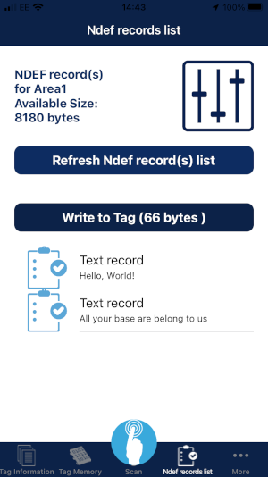

# Example 10 - NDEF Text

An example showing how to create an NDEF Text record using the SparkFun ST25DV64KC Arduino Library.

## Key Features

- Writing the tag's Capability Container (CC)
- Writing an NDEF Text record
- Reading an NDEF Text record

## Creating an NDEF Text Record

Only a small amount of extra information is needed to create an NDEF Text record. It is another "Well-Known Type":

```C++
/*
  To create a NDEF Text record:

  (See above for TLV formatting)

  Byte 0: Record Header
          b7 = MB (Message Begin)
          b6 = ME (Message End)
          b5 = CF (Chunk Flag)
          b4 = SR (Short Record)
          b3 = IL (ID Length)
          b2 b1 b0 = 0b001 TNF (Type Name Format): NFC Forum Well-Known Type
  Byte 3: Type Length
          0x01 = 1 Byte
  Byte(s) 4: Payload Length (1-Byte or 4-Byte format)
  Byte n: Record Type
          0x54 = "T" Text Record
  Byte n+1: Text Data header
          b7 = UTF 8/16 (0 = UTF 8 encoding)
          b6 = reserved
          b5-b0 = Language Code Length
  Bytes n+2: Language Code ("en" = English)
  Bytes n+2+LCL: Text Data
*/
```

The code to create two text records is:

```C++
  // Write two NDEF UTF-8 Text records
  uint16_t memLoc = tag.getCCFileLen();

  Serial.println(F("Writing the first NDEF Text record"));
  tag.writeNDEFText("Hello, World!", &memLoc, true, false); // MB=1, ME=0
  
  Serial.println(F("Writing the second NDEF Text record"));
  tag.writeNDEFText("All your base are belong to us", &memLoc, false, true); // MB=0, ME=1
```

It is possible to write multiple URI, WiFi and Text records into a single tag.

## Reading an NDEF Text Record

Reading the text record is as simple as:

```C++
  // Read back the second NDEF UTF-8 Text record
  Serial.println(F("Reading the second NDEF Text record:"));
  char theText[40];
  if (tag.readNDEFText(theText, 40, 2))
    Serial.println(theText);
  else
    Serial.println(F("Read failed!"));
```






